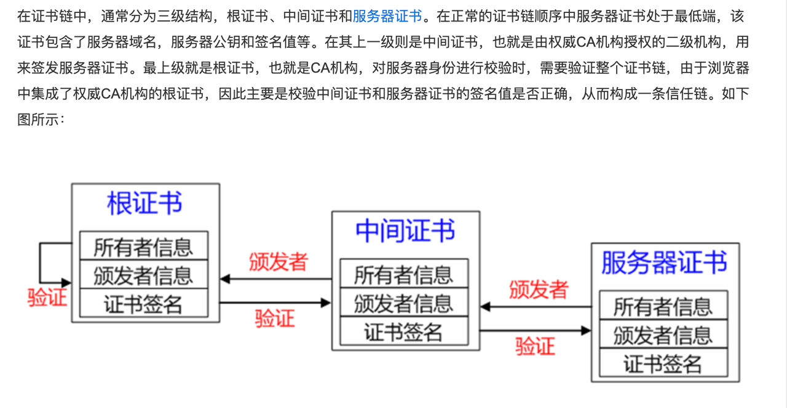

# 苹果服务端通知v2处理
关键词: App Store Server Notifications V2、Python源码、苹果订阅、JWS、x5c、JSON WEB TOKEN

## 背景
最近要接入苹果订阅功能，调研后发现订阅生命周期内的状态变更是通过苹果服务端通知返回的(什么时候普通内购也能加上减少掉单的概率)，
其回调的正确性验证是依靠回调内容里的几个证书，捣鼓这块耗费了好几天时间，所以在此记录一下。

### JWS
苹果服务端返回的数据格式为JWS，之前没处理过这种类型的数据，其实本质上还是JWT那一套，关于JWS的介绍
参考[IETF RFC 7515-JSON Web Signature](https://datatracker.ietf.org/doc/html/rfc7515#section-4.1.6)

### JWS格式与验证
jws格式为 **header**.**payload**.**signature**    
其中每部分都是基于urlbase64加密过的，需要使用urlbase64解密得到内容。
其中，header最为关键，其内容为：
```json
{
  "alg": "ES256",
  "x5c": [
    "服务器证书",
    "中间证书",
    "根证书"
  ]
}
```
`alg`为本次回调的签名算法，`ES256`代表为 `ECDSA using SHA-256 hash algorithm`，
`x5c`则为证书链，其内部的第一个证书为验证本次回调签名所使用，需要先将证书转为`X509`格式，再从其中解析出公钥，使用公钥对数据进行验签

`payload`部分就是本次通知的业务数据，此处不做过多描述，参考[官方文档](https://developer.apple.com/documentation/appstoreservernotifications/responsebodyv2decodedpayload?changes=latest_minor)

`signature`则是本次签名的结果。

简单的来说就是该格式包含了**详细数据**、**证书链**、**签名算法**、**签名结果**。  
需要我们在本地完成数据的正确性和合法性：
- 合法性：验证证书链是可信的。
- 正确性：使用证书链中的服务器证书内的公钥验证数据和签名是正确未经过篡改的。

## 验证思路

### x5c证书链的验证
这块参考了下图
也就是说，证书链内有三个证书，分别是服务器证书、中间证书、根证书。   其验证顺序是
- 使用中间证书验证服务器证书
- 使用根证书验证中间证书
- 使用根证书验证中间证书

那么根证书本身呢？ 则需要用苹果官方的提供的根证书进行验证。如果整个验证流程下来都验证成功了，那么整个证书链就是可信的了。
其中苹果官方提供的根证书为AppleRootCA-G3.cer，需要自己从官网下载，[下载地址](https://www.apple.com/certificateauthority/AppleRootCA-G3.cer)

Python对证书的验证主要使用了`openssl.crypto`包下面的`X509Store`和`X509StoreContext`
其基本思路为
- 将可信证书(一般为root证书)先加载至X509Store实例内，然后使用X509StoreContext对待验证证书进行verify_certificate验证
- 单个证书验证如此，对于一个证书链，优先将待验证的证书验证完毕后加入到X509Store实例内，然后再继续验证后一个即可，以此类推。

python实现代码如下：
```python
from OpenSSL import crypto
def verify_apple_jws_cert_chain(x5c):
    """
    验证苹果server notify的证书链
    'x5c':['服务器证书','中间证书','根证书']
    我们验证顺序: 苹果根证书->x5c根证书, x5c根证书->中间证书, 中间证书->服务器证书
    :param x5c:
    :return:
    """
    if not x5c or not isinstance(x5c, list):
        return "x5c type error"
    # 加载x5c证书，转为X509证书格式
    x5c_cert = []
    try:
        for each in x5c:
            cert = "-----BEGIN CERTIFICATE-----\n" + each + "\n-----END CERTIFICATE-----"
            new_cert = crypto.load_certificate(crypto.FILETYPE_PEM, cert)
            x5c_cert.append(new_cert)
    except Exception as e:
        return "x5c certification load exception {}".format(e)
    # 加载苹果根证书
    cert_file = open("./AppleRootCA-G3.cer", "rb")
    apple_root_cert = crypto.load_certificate(crypto.FILETYPE_ASN1, cert_file.read())
    cert_file.close()

    # 接下来验证证书链，验证失败会报错:OpenSSL.crypto.X509StoreContextError: unable to get local issuer certificate
    # 首先验证x5c内的根证书
    store = crypto.X509Store()
    store.add_cert(apple_root_cert)
    try:
        store_ctx = crypto.X509StoreContext(store, x5c_cert[2])
        store_ctx.verify_certificate()
    except Exception as e:
        return "verify root certification exception {}".format(e)

    # 接下来验证x5c内的中间证书
    store.add_cert(x5c_cert[2])
    try:
        store_ctx = crypto.X509StoreContext(store, x5c_cert[1])
        store_ctx.verify_certificate()
    except Exception as e:
        return "verify mid certification exception {}".format(e)

    # 最后验证服务器证书
    store.add_cert(x5c_cert[1])
    try:
        store_ctx = crypto.X509StoreContext(store, x5c_cert[0])
        store_ctx.verify_certificate()
    except Exception as e:
        return "verify server certification exception {}".format(e)

    # 最终验证成功
    return ""
```

### JWS的签名验证
验证完证书链后，那么签名的验证就好说了，目前的 [jwt库](https://jwt.io/libraries?language=Python) 基本上都支持ES256签名了
不过我们需要先从x5c内获取服务器证书，将其转为X509对象后，获取其中的公钥，并使用公钥来验签，基本代码如下
```python
import jwt
from OpenSSL import crypto

# 获取服务器证书
alg = header.get("alg")
x5c = header.get("x5c")
server_cert = x5c[0]
# 将服务器证书转为X509证书对象
cert = "-----BEGIN CERTIFICATE-----\n" + server_cert + "\n-----END CERTIFICATE-----"
server_cert = crypto.load_certificate(crypto.FILETYPE_PEM, cert)
# 从证书内解析出公钥
public_key = crypto.dump_publickey(crypto.FILETYPE_PEM, server_cert.get_pubkey()).decode("utf-8")
# 使用公钥对整个jws进行验签
decode_jws = jwt.decode(jws, public_key, algorithms=[alg])
```
完整的代码和单元测试用例我放在[我的github](https://github.com/noobcoderr/apple-server-notification-tools) 上了
如果你觉得对你有帮助，希望帮忙点个star。

## 参考
[StoreKit2【附源码】JWS X.509证书链验证](https://juejin.cn/post/7039970403770433544)  
[JWS-X.509 Certificate Chain](https://datatracker.ietf.org/doc/html/rfc7515#section-4.1.6)


