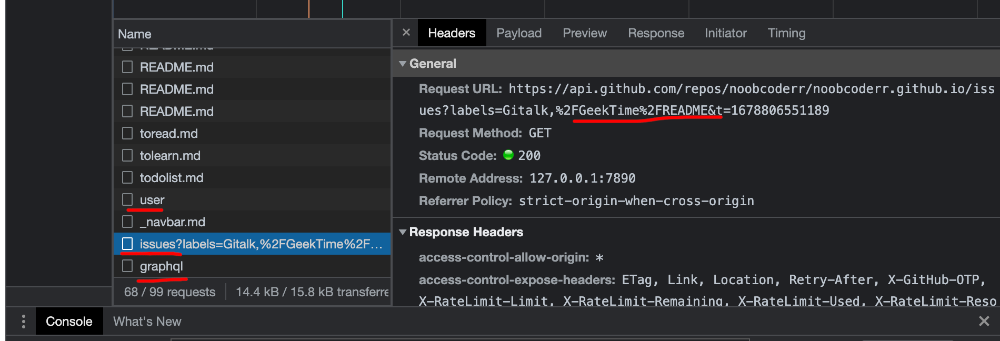

# Docsify+GithubPages建站踩坑指南

## 背景
去年年度述职，我感觉构建自己的`研发管理知识体系`比较重要，然后想选择一款免费的管理自己的WIKI的工具

之前用过hugo部署过静态博客，但是这个比较适合单篇的博客，感觉不适合系统化的记录知识，

后面又想到了gitbook，但是其主题太单调了，最后发现了[docsify](https://docsify.js.org/#/zh-cn/)，比较干净清爽，颜值尚可，最后就决定使用这个工具记录我的个人体系化WIKI

其实工具是次要的，最主要的还是自己要不断地输出内容。


## docsify使用+github pages部署
跟着官网的教程基本上可以完成[建站加部署](https://docsify.js.org/#/zh-cn/deploy)

但是有个问题，如果想要使得 `https://xxx.github.io/` 打开就是该网站首页

那么文章需要放在`xxx.github.io`仓库下面，如果是在其他仓库B，那么得`https://xxx.github.io/B/` 才是该站点的首页

## 踩过的坑
基础使用上，跟着官方的教程走不会出问题，在插件的使用上，还是需要一些踩坑经验的，我目前主要在使用gitalk时遇到了问题，这里记录一下

### 0.简单介绍下使用

配置项如下：
```markdown
clientID: 'Github Application Client ID',
clientSecret: 'Github Application Client Secret',
repo: 'Github repo',
owner: 'Github repo owner',
admin: ['Github repo collaborators, only these guys can initialize github issues'],
distractionFreeMode: false
```
直接按我的仓库来举例说明 `https://github.com/noobcoderr/noobcoderr.github.io`

**clientID和clientSecret生成方式**
- github里点击个人头像进入`settings`，然后进入`Developer settings`, 进入`Oauth APPs`，点击`New OAuth App`新建一个Oauth应用 
- `APPlication Name`随意填，`Homepage Url`和`Authorization callback URL`都填`https://noobcoderr.github.io/`. 此处如果有个人域名，那么`Authorization callback URL`填个人域名
- 完成之后会生成一份`Client ID`和`Client secrets`，secrets首次是完整显示的，需要记录好，后续打开这个页面就不会显示完整的了，只能新建一个

**repo、owner、admin、distractionFreeMode的填写**
- repo就是填仓库名，这里对应我的`noobcoderr.github.io`
- owner就填用户名，这里对应我的`noobcoderr`
- admin也是填用户名或者组织名，就是允许建立issue的人或者组织，这里是个人仓库，所以也只填`['noobcoderr']`
- distractionFreeMode 无干扰模式，默认跟着填false

### 1.评论混乱
**现象**   

1、打开网站后任意点开一篇文章，进行评论，然后点开另一篇文章，此时评论区保持和上一篇文章的一致

2、此时在该文章下进行评论，此时查看远程仓库issue，发现评论仍然在上一篇issue里

**原因分析**

在开发者模式观察Network模式下执行第一步和第二步，发现
刷新当前页面时，会执行三次网络请求
1. 访问`https://api.github.com/user`获取当前github用户信息
2. 访问以页面标题为`title`，`Gitalk`和路由`path`为`label`为查询条件，查询符合条件的`issue`信息，此时为精确查询
3. 请求`/graphql`接口获取`issue`和`issue`的评论信息，查询条件为第二步返回的`issue_id`



当点击一篇其他文章的时候，也会执行上述的三次网络请求
1. 访问`https://api.github.com/user`获取当前github用户信息
2. 以首次进入页面时的查询条件查询符合条件的issue
3. 请求`/graphql`接口获取`issue`和`issue`的评论信息，查询条件为第二步返回的`issue`列表里的第一条`issue`的`issue_id`

可以发现，我们进入网站后点击其他文章时的查询`issue`条件其实是第一次刷新页面时的查询条件，所以后面不论是查询`issue`下的评论，还是对该文章进行评论，
最终都会限定在符合第一次查询时的`issue`里。

当然最底层的原因猜测可能切换文章时gitalk组件的生命周期未结束，仍然维护的最开始的一篇文章的筛选条件，切换文字时未使用最新的path作为筛选条件
这个需要分析其源码可能才能具体定位了。

**解决办法**

切到一篇文章后如果要进行评论，刷新一下当前页面即可，结束上一次页面的gitalk的生命周期

### 2.gitalk模块调整不出来

官方的配置是这样的：
```markdown
<link rel="stylesheet" href="//cdn.jsdelivr.net/npm/gitalk/dist/gitalk.css">

<script src="//cdn.jsdelivr.net/npm/docsify/lib/plugins/gitalk.min.js"></script>
<script src="//cdn.jsdelivr.net/npm/gitalk/dist/gitalk.min.js"></script>
<script>
  const gitalk = new Gitalk({...})
</script>
```

看了教程以为css和js都放`<head>`里，或者都放`<body>`里，但是我当时怎么调最后都没有出现`Gitalk`模块

这块官方教程里css文件和js文件中间用一个空行隔开，应该就是css文件引用要放`<head>`里，js引用要放`<body>`里，

我前端基础知识较少，所以这块也花了段时间来调整，才把评论模块调出来。

### 3.issue初始化创建失败

**现象**

本地调试时，无法创建issue，在gitalk处点击登录github时，直接回到首页

**分析**

这是因为这一步需要使用github登录，会拉起Oauth授权，即你授权给`noobcoderr`的评论Oauth应用，拉起授权时需要提供一个`redirect url`，

由于是在本地调试，所以域名为`localhost:3000`，这个在github授权完成后进行重定向跳转的时候由于不是公网域名，所以无法识别。

**解决办法**

所以在本地就不要调试`Gitalk`了，推到远程分支后，在自己的`github-pages`页面进行调试

### 4.部分文章创建的issue都一样

**分析**

因为参照docsify官网的配置，没有配置id选项，此时默认使用的为`location.href`作为创建`issue`的`label`，就是页面的完整url,

但是`github`对`label`的长度有50的限制，超过50的部分会被截取，只取前50位

而我的域名`https://noobcoderr.github.io/#/`就已经占据了31的长度了，而我对不同文章的文件夹的命名又比较长

例如编程语言Python下的最佳实践文章，其完整url为`https://noobcoderr.github.io/#/ProgramLanguages/Python/python_best_practice`，其长度为75

当截取为50长度时的结果为`https://noobcoderr.github.io/#/ProgramLanguages/Py`,那么Python文件夹下的所有文章的issue都是一样的，因为label超长了，都被截取了
只保留相同的前缀。

**解决办法**

我看网上有人推荐以下两种，但是经过我的实践，好像都不太行
- 使用`md5(location.href)`, 这样其实也可以，基于完整url的散列值基本不会重复，就是仓库里的labels不直观，因为散列值就只是一些随机字符串

- 使用`location.pathname`，其实这不适合docsify建立的项目，因为其生成的文章url为`host/#/path`中间带一个`#`，取location.pathname取到的就是一个`/`，那么所有文章的label都一样了
但是使用hugo之类建立的文章好像就没有这个问题，可以使用该值。

经过我的测试，最后使用`location.href.split('#')[1]`作为id配置项，可以取到正常的pathname，也可以作为页面的唯一标识


## Gitalk的源码简单分析

作为一个Python服务端，看了看Gitalk的源码，还是可以看出一些表面的意思的，源码文件为[gitalk.jsx](https://github.com/gitalk/gitalk/blob/master/src/gitalk.jsx)

关键的一些源码粘贴如下：
```javascript
class GitalkComponent extends Component {
  state = {
    user: null,
    issue: null,
    comments: [],
    localComments: [],
    comment: '',
    isNoInit: false,
    isIniting: true,
    isCreating: false,
    isOccurError: false,
    errorMsg: '',
  }
  constructor (props) {
    super(props)
    this.options = Object.assign({}, {
      id: window.location.href,
      number: -1,
      labels: ['Gitalk'],
      title: window.document.title,
      body: '', // window.location.href + header.meta[description]
      url: window.location.href,
    }, props.options)
  }
}
  render () {
    const { isIniting, isNoInit, isOccurError, errorMsg, isInputFocused } = this.state
    return (
      <div className={`gt-container${isInputFocused ? ' gt-input-focused' : ''}`}>
        {isIniting && this.initing()}
        {!isIniting && (isNoInit ? [] : [this.meta()])}
        {isOccurError && <div className="gt-error">{errorMsg}</div>}
        {!isIniting && (isNoInit ? [this.noInit()] : [this.header(),this.comments()])}
      </div>
    )
  }
}

module.exports = GitalkComponent
```

分析gitalk源码
入口应该为`render()`
该方法会返回一个`gitalkgt-container`容器，这个容器就是包含gitalk的模块，执行流程为  
- <第一块> 展示初始化状态，初始化时展示Gitalk 加载中 ...  
- <第二块> 在初始化结束的情况下，如果成功则执行`this.meta()`, 该部分获取各种元数据并展示 
- <第三块> 在发生错误的时候在`gt-error`模块内展示错误信息  
- <第四块> 在初始化结束的情况下，如果成功则执行`header`方法和`comments`方法，不成功则执行`this.noInit`方法  

**meta方法**

只做数据展示，不做数据获取，登录时展示评论数量，以及一些弹出式菜单，如注销，按时间正序/倒序排序，gitalk版本等等，未登录时展示登录按钮等

**header和comments方法**

展示已有的数据，没有获取数据操作

**noInit方法**

该方法这个方法会拿到文章对应issue的所有评论

- 最开始是展示未找到相关的issue进行评论，请联系用户进行创建
- 如果未登录github的话，展示按钮进行登录，进行Oauth授权，获取用户信息
- 如果当前登录github用户是此仓库管理员的话，那么展示创建issue按钮，调用handleIssueCreate方法
  - **handleIssueCreate方法**: 会调用`createIssue`方法创建issue，创建完成后，会调用`getComments`方法获取当前issue的所有评论
  - **createIssue方法**: 创建issue。在配置的owner用户下的repo仓库里，以页面的title为issue的标题，以Gitalk和id为issue的labels，以页面完整的url作为issue的内容，即首条评论
  - **getComments方法**：获取issue的所有评论，如果未登录，则调用getCommentsV3方法，如果登录了，则调用graphql的getComments方法
  - **getCommentsV3方法**：获取issue的评论，首先按照issue_id进行取，如果取到就展示到页面上，如果未取到则安labels进行取
  - **graphql的getComments方法**：获取指定issue_id的所有评论
  - **handleLogin方法**：会将所有评论放在浏览器的本地存储里

从源码可见`GitalkComponent`维护了很多数据，每次进入新页面都会调用render()方法，但是上一次的数据有没有被清理我不太清楚，理论上应该会被清理，
但是上面提到的评论混乱确实是感觉有缓存，这点需要后面咨询一下搞前端的同事确认下。

### 学习到的javascript知识
- 三元表达式  bool ? A : B  ，如果bool为真，则执行A，bool为假，则执行B
- && 高级用法：用于执行语句 bool && func(), 如果bool为真，则执行后面的语句
- .jsx文件为React框架对javascript的扩展


